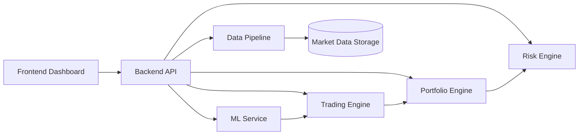

# RustQuant

*RustQuant* is a modular quantitative finance platform built using the Rust programming language.

The project provides infrastructure for:

- Financial modeling  
- Market data processing  
- Machine learning  
- Trading systems  
- Portfolio analytics  

The system is designed to combine *high-performance Rust computation* with *modern data engineering and machine learning pipelines* to enable research, experimentation, and development of algorithmic trading systems.

---

## Platform Capabilities

The architecture integrates:

- Market data ingestion  
- Feature engineering pipelines  
- Machine learning services  
- Trading engines  
- Portfolio and risk analytics  
- Interactive dashboards  

---

RustQuant leverages *Rust’s performance, safety, and concurrency features* to build scalable financial systems suitable for:

- Quantitative research  
- Algorithmic trading  
- Financial analytics platforms

---

## System Architecture

The platform follows a *modular service architecture* where each subsystem performs a specific role within the quantitative trading workflow.

Each module is designed to operate independently while communicating through well-defined interfaces. This architecture enables scalability, maintainability, and flexibility for extending the system with new financial models, trading strategies, and analytics services.



This architecture enables *independent development and scaling of each component*, allowing teams to improve individual modules such as data pipelines, machine learning services, and trading engines without impacting the rest of the platform.

## Project Structure

The repository is organized into modular components, each responsible for a specific part of the quantitative trading platform.

```text
RustQuant/
│
├── backend/        # Core backend services and financial engines
│
├── data_pipeline/  # Market data ingestion and feature engineering pipelines
│
├── ml_service/     # Machine learning models and prediction services
│
├── frontend/       # Dashboard interface for visualization and monitoring
│
├── deployment/     # Infrastructure configuration and deployment tooling
│
└── docs/           # Documentation and system design resources
```

## Core Modules

### Data Pipeline

The *data pipeline* is responsible for collecting and preparing financial data used across the platform.

**Responsibilities**

- Market data ingestion  
- Historical data loading  
- Data cleaning and normalization  
- Feature engineering  
- Storage and streaming  

**Data Sources**

- Market APIs  
- Historical datasets  
- Streaming market feeds  

**Outputs Used By**

- ML models  
- Trading strategies  
- Portfolio analytics  

---

### ML Service

The *machine learning service* enables predictive modeling and financial analytics.

**Capabilities**

- Regression models  
- Classification models  
- Feature-based predictive modeling  
- Model evaluation and inference  

**Typical Applications**

- Price prediction  
- Market trend classification  
- Trading signal generation  
- Risk forecasting  

---

### Trading Engine

The *trading engine* implements algorithmic trading logic.

**Key Components**

- Signal generation  
- Order management  
- Trade execution  

The engine receives signals from *ML models and trading strategies*, and manages order placement and execution logic.

---

### Portfolio Engine

The *portfolio engine* tracks the state of financial portfolios.

**Capabilities**

- Portfolio valuation  
- Position tracking  
- Profit and loss calculations  
- Asset allocation analysis  

---

### Risk Engine

The *risk engine* calculates financial risk metrics to ensure trading strategies remain within acceptable limits.

**Examples**

- Value-at-Risk (VaR)  
- Volatility estimation  
- Maximum drawdown  
- Exposure analysis  

---

### Frontend

The *frontend* provides a dashboard for interacting with the system.

**Features**

- Market data visualization  
- Portfolio dashboards  
- Trading signal monitoring  
- Risk analytics visualization  

---

### Deployment Infrastructure

The *deployment layer* enables production deployment of the platform.

**Features**

- Docker containerization  
- CI/CD pipelines  
- Infrastructure provisioning  
- Monitoring and observability  

---

# Technology Stack

| Layer | Technology |
|------|-------------|
| Core Language | Rust |
| Data Processing | Rust Async Pipelines |
| Machine Learning | RustQuant ML modules |
| Linear Algebra | Nalgebra |
| Storage | PostgreSQL / Parquet |
| Streaming | Kafka / Event Streams |
| Frontend | TypeScript / React |
| Deployment | Docker / CI-CD |

---

# Example Use Cases

RustQuant can be used for:

- Quantitative trading research  
- Algorithmic trading infrastructure  
- Financial modeling  
- Risk analytics systems  
- Portfolio optimization research  
- Machine learning for financial markets  

---

# Development Status

Current capabilities include:

- Market data ingestion pipelines  
- Feature engineering infrastructure  
- Machine learning service  
- Trading and portfolio modules  
- Risk analytics framework  
- Dashboard frontend  
- Deployment infrastructure  

---

# Future Roadmap

Planned improvements include:

- Reinforcement learning trading agents  
- Distributed market data pipelines  
- Real-time streaming analytics  
- Advanced backtesting engine  
- High-frequency trading infrastructure  
- Model monitoring and drift detection  
