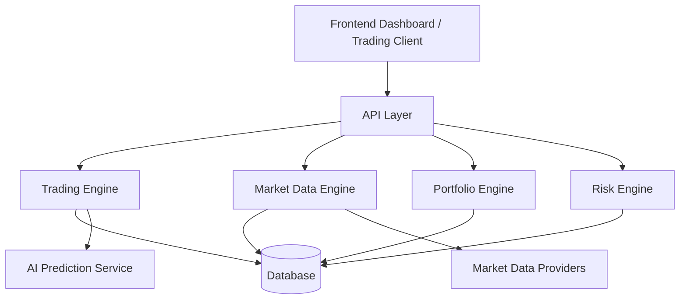

# RustQuant – Backend
**High-Performance Quantitative Trading Infrastructure**

---

## Overview

This repository contains the backend system powering the **RustQuant trading platform**.

The backend serves as the **core computational and orchestration layer** responsible for:

- Market data ingestion and processing  
- Trading signal generation  
- Portfolio tracking and analytics  
- Risk management calculations  
- Integration with AI-based prediction services  

It acts as the **deterministic control system** of the platform, ensuring that all trading decisions, predictions, and portfolio state transitions are validated, structured, and persisted safely.

The system is designed with a focus on:

- **Performance** (Rust-based execution)  
- **Deterministic data flow**  
- **Modular financial engines**  
- **Scalable architecture for quantitative trading**

---

## Core Responsibilities

The backend coordinates all components of the trading system, including:

- Secure API communication with the frontend dashboard  
- Financial data processing and indicator computation  
- Trading signal generation and execution logic  
- Portfolio valuation and PnL calculation  
- Risk analytics and capital preservation metrics  
- AI-assisted market predictions  

It acts as the **central authority for trading state and financial data integrity**.

---

## System Capabilities

### Market Data Processing

The backend provides mechanisms to ingest and process financial market data.

Capabilities include:

- Market price ingestion  
- Time series normalization  
- Technical indicator computation  
- Feature engineering for ML models  

The processed data becomes the **foundation for algorithmic trading logic and AI-based forecasting models**.

---

### Algorithmic Trading Logic

The backend implements deterministic trading logic through modular engines.

Key responsibilities include:

- Trading signal generation  
- Order validation and routing  
- Execution simulation or live execution integration  

Signals may originate from:

- Technical indicators  
- Statistical models  
- AI-based prediction systems  

---

### Portfolio State Management

The backend maintains the **complete state of all portfolios**.

Capabilities include:

- Holdings tracking  
- Portfolio valuation  
- Real-time PnL computation  
- Asset allocation analysis  

This ensures that the system always maintains a **consistent financial state representation**.

---

### Risk Analytics

Risk management is a core component of quantitative trading systems.

The backend computes key financial risk metrics including:

- Portfolio volatility  
- Maximum drawdown  
- Value at Risk (VaR)

These metrics ensure that trading strategies operate within **acceptable risk boundaries**.

---

## Quantitative Modeling Logic

### Portfolio Valuation

Let:

- $p_i$ = price of asset $i$  
- $q_i$ = quantity of asset $i$

Total portfolio value:

$$
V_{portfolio} = \sum_{i=1}^{n} p_i \cdot q_i
$$

This value is recalculated continuously as market prices change.

---

### Profit and Loss (PnL)

Let:

- $V_t$ = portfolio value at time $t$  
- $V_{t-1}$ = portfolio value at the previous step  

Then:

$$
PnL_t = V_t - V_{t-1}
$$

This metric tracks **real-time trading performance**.

---

### Maximum Drawdown

Maximum drawdown represents the **largest observed loss from peak to trough**.

Let:

- $V_{peak}$ = highest historical portfolio value  
- $V_{current}$ = current portfolio value  

Then:

$$
Drawdown = \frac{V_{peak} - V_{current}}{V_{peak}}
$$

This metric is critical for evaluating **strategy stability**.

---

### Trading Signal Model

Trading signals represent directional expectations of price movement.

$$
S_t \in \{-1,0,1\}
$$

| Signal | Meaning |
|------|------|
| -1 | Sell |
| 0 | Hold |
| 1 | Buy |

Signals may be generated using:

- Technical indicators  
- Machine learning predictions  
- Reinforcement learning strategies  

---

## Project Structure

```
backend/
├── src/
│
├── api/
│   ├── health.rs
│   ├── auth.rs
│   ├── market.rs
│   ├── trading.rs
│   ├── portfolio.rs
│   └── prediction.rs
│
├── market_data_engine/
│   ├── data_fetcher.rs
│   ├── indicators.rs
│   └── feature_engineering.rs
│
├── trading_engine/
│   ├── signal_generator.rs
│   ├── order_manager.rs
│   └── execution_engine.rs
│
├── portfolio_engine/
│   ├── portfolio.rs
│   ├── holdings.rs
│   └── pnl_calculator.rs
│
├── risk_engine/
│   ├── var.rs
│   ├── volatility.rs
│   └── drawdown.rs
│
├── services/
│   ├── ml_client.rs
│   ├── trading_service.rs
│   └── market_service.rs
│
├── db/
│   ├── connection.rs
│   ├── repository.rs
│   └── migrations/
│
└── utils/
    ├── logger.rs
    └── error_handler.rs
```

# System Architecture

## High-Level Architecture



## Core Layers

### API Layer

Handles all client communication.

**Responsibilities:**

- Request validation  
- Response normalization  
- API routing  

---

### Trading Engine Layer

Implements algorithmic trading logic including:

- Signal generation  
- Order management  
- Trade execution  

---

### Portfolio Engine Layer

Maintains portfolio state and computes:

- Portfolio valuation  
- Profit and loss  
- Asset allocation metrics  

---

### Risk Engine Layer

Computes risk metrics to ensure strategy safety.

---

### Persistence Layer

Responsible for storing system data.

**Database Technology**

PostgreSQL

**Stored Data Includes**

- Market prices  
- Trades  
- Portfolio states  
- Strategy results  

---

# Technology Stack

| Component | Technology |
|-----------|-----------|
| Language | Rust |
| Backend Framework | Rust API Framework |
| Database | PostgreSQL |
| Architecture | Modular Financial Engines |
| AI Integration | External ML Service |

---

# Security Principles

The backend follows strict safety principles:

- Trading inputs are validated before execution
- Portfolio state transitions are deterministic
- Risk metrics are recomputed continuously
- AI predictions are treated as **advisory signals only**

---

# Intended Use Cases

This backend architecture is suitable for:

- Quantitative trading research platforms
- Algorithmic trading systems
- AI-assisted financial analytics
- Portfolio strategy experimentation
- Financial engineering demonstrations

---

# Development Status

Current backend capabilities include:

- Market data ingestion infrastructure
- Trading signal generation framework
- Portfolio state tracking
- Risk analytics calculations
- API interface for frontend and ML services

---

# Future Enhancements

Planned improvements include:

- Reinforcement learning trading agents
- Strategy backtesting engine
- Real-time market streaming
- Distributed market data pipeline
- High-frequency trading infrastructure

---

# License

This project is intended for **research, experimentation, and portfolio demonstration purposes**.
