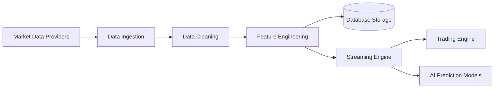

# Data Pipeline

The **Data Pipeline** module is responsible for ingesting, processing, and preparing financial market data for downstream components such as trading engines, portfolio analytics, and machine learning models.

It ensures that raw market data is transformed into structured datasets that can be efficiently used for quantitative analysis and algorithmic trading.

---

## Project Structure

```text
data_pipeline/
├── data_sources/
│   ├── market_api.rs
│   ├── historical_loader.rs
│   └── streaming_client.rs
│
├── ingestion/
│   ├── fetcher.rs
│   ├── scheduler.rs
│   └── retry_handler.rs
│
├── preprocessing/
│   ├── cleaner.rs
│   ├── normalization.rs
│   └── missing_data.rs
│
├── feature_engineering/
│   ├── technical_indicators.rs
│   ├── statistical_features.rs
│   └── factor_models.rs
│
├── storage/
│   ├── database_writer.rs
│   ├── parquet_writer.rs
│   └── cache.rs
│
├── streaming/
│   ├── kafka_producer.rs
│   └── event_stream.rs
│
└── utils/
    ├── time_utils.rs
    └── data_validator.rs
```


---

# Core Components

## Data Sources Layer

Responsible for retrieving raw financial data from external providers.

Typical sources include:

- Market APIs
- Exchange feeds
- Historical price databases
- Streaming market data

Responsibilities:

- API communication  
- Authentication and request handling  
- Data format parsing  

---

## Data Ingestion Layer

Manages reliable ingestion of market data into the system.

Responsibilities:

- Scheduled data collection  
- Retry mechanisms for failed requests  
- Rate limit management  
- Data pipeline orchestration  

---

## Data Preprocessing Layer

Transforms raw market data into structured and consistent datasets.

Responsibilities:

- Data cleaning  
- Handling missing values  
- Timestamp normalization  
- Outlier detection  

---

## Feature Engineering Layer

Generates quantitative features used by trading strategies and ML models.

Examples include:

- Technical indicators  
- Statistical features  
- Factor models  
- Volatility metrics  

---

## Storage Layer

Handles persistent storage of processed datasets.

Supported storage formats:

- PostgreSQL databases  
- Parquet datasets  
- In-memory caching  

Stored data includes:

- Historical market prices  
- Engineered features  
- Derived indicators  
- Aggregated market statistics  

---

## Streaming Layer

Provides real-time data streams for downstream systems.

Used for:

- Live trading systems  
- Real-time analytics  
- AI prediction pipelines  

Technologies may include:

- Kafka
- WebSocket feeds
- Event-driven messaging

---

# Data Pipeline Workflow



# Technology Stack

| Component | Technology |
|-----------|-----------|
| Language | Rust |
| Data Processing | Rust Async Pipelines |
| Storage | PostgreSQL / Parquet |
| Streaming | Kafka / Event Streams |
| Architecture | Modular Data Pipelines |

---

# Development Status

Current pipeline capabilities include:

- Market data ingestion  
- Historical data loading  
- Feature engineering infrastructure  
- Data validation utilities  
- Storage and caching interfaces  

---

# Future Enhancements

Planned improvements include:

- Distributed data ingestion  
- Real-time streaming pipelines  
- Multi-exchange market connectors  
- AI feature pipelines  
- High-frequency data processing  
