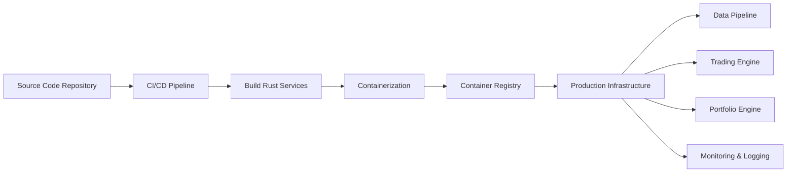

# Deployment

The *Deployment* module provides infrastructure and tooling required to *build, package, and deploy the RustQuant system into production environments*.

It enables automated deployment of services including:

- Data pipelines  
- Trading engines  
- Analytics modules  

The module supports:

- *Containerized deployments*
- *Cloud infrastructure integration*
- *CI/CD pipelines*

These capabilities ensure *reliable system rollout and scalable production deployment* of the RustQuant platform.

## Project Structure

```text
deployment/
├── docker/
│   ├── Dockerfile
│   ├── docker-compose.yml
│   └── container_config.rs
│
├── infrastructure/
│   ├── cloud_setup.rs
│   ├── networking.rs
│   └── security_groups.rs
│
├── ci_cd/
│   ├── github_actions.yml
│   ├── pipeline.rs
│   └── release_manager.rs
│
├── monitoring/
│   ├── metrics.rs
│   ├── logging.rs
│   └── alerting.rs
│
└── scripts/
    ├── deploy.sh
    ├── rollback.sh
    └── health_check.sh
```

# Core Components

## Containerization Layer

Responsible for packaging system services into portable containers.

**Responsibilities**

- Build Rust service containers  
- Manage service dependencies  
- Define container runtime configuration  

**Technologies**

- Docker  
- Docker Compose  

---

## Infrastructure Layer

Defines infrastructure resources required to run the system.

**Responsibilities**

- Cloud resource provisioning  
- Networking configuration  
- Security group management  

**Possible Cloud Platforms**

- AWS  
- Google Cloud  
- Azure  

---

## CI/CD Layer

Automates building, testing, and deployment pipelines.

**Responsibilities**

- Continuous integration  
- Automated testing  
- Deployment orchestration  
- Versioned releases  

**Typical CI Tools**

- GitHub Actions  
- Jenkins  
- GitLab CI  

---

## Monitoring Layer

Provides observability and operational visibility for deployed services.

**Responsibilities**

- System metrics collection  
- Application logging  
- Alert generation  

**Common Monitoring Integrations**

- Prometheus  
- Grafana  
- ELK Stack  

---

# Deployment Architecture


---

# Technology Stack

| Component | Technology |
|-----------|-----------|
| Language | Rust |
| Containerization | Docker |
| CI/CD | GitHub Actions |
| Monitoring | Prometheus / Grafana |
| Infrastructure | Cloud Deployment |

---

# Deployment Workflow

1. Developer pushes code to the repository  
2. CI pipeline builds Rust services  
3. Automated tests are executed  
4. Containers are built and pushed to the registry  
5. Infrastructure deployment is triggered  
6. Services are deployed to the production environment  

---

# Development Status

Current deployment capabilities include:

- Rust service containerization  
- CI/CD pipeline integration  
- Deployment scripts  
- Monitoring infrastructure setup  

---

# Future Enhancements

Planned improvements include:

- Kubernetes deployment support  
- Auto-scaling infrastructure  
- Canary deployments  
- Distributed microservice orchestration  
- Multi-region deployment support  
