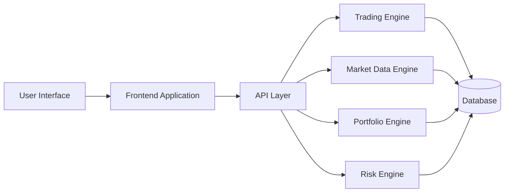

# Frontend

The *Frontend* module provides the user interface for interacting with the RustQuant platform.

It enables visualization and interaction with:

- Market data
- Trading strategies
- Portfolio analytics
- Risk metrics
- AI-generated trading signals

The frontend communicates with backend APIs to fetch financial data, display analytics dashboards, and allow users to monitor system performance.

---

# Responsibilities

The frontend layer is responsible for:

- Rendering financial dashboards
- Displaying real-time market data
- Visualizing portfolio performance
- Presenting trading signals and analytics
- Interacting with backend APIs

---

# Core Features

## Market Data Visualization

Displays financial market information including:

- Asset prices
- Market indicators
- Time-series data

---

## Portfolio Dashboard

Provides real-time monitoring of portfolio performance.

Key metrics include:

- Portfolio valuation
- Profit and loss
- Asset allocation
- Historical performance

---

## Strategy Monitoring

Allows users to observe algorithmic trading strategies.

Features include:

- Signal visualization
- Strategy performance metrics
- Execution status monitoring

---

## Risk Analytics

Displays risk metrics generated by the backend risk engine.

Examples include:

- Value-at-Risk (VaR)
- Volatility measures
- Maximum drawdown

---

# Frontend Architecture

# Technology Stack

| Component | Technology |
|-----------|-----------|
| Language | TypeScript / JavaScript |
| UI Framework | React / Modern Web Framework |
| Data Visualization | Charting Libraries |
| API Communication | REST / HTTP |
| Architecture | Dashboard-based UI |

---

# Development Status

Current frontend capabilities include:

- Basic dashboard interface  
- API communication with backend services  
- Market data visualization  
- Portfolio monitoring interface  

---

# Future Enhancements

Planned improvements include:

- Real-time streaming dashboards  
- Interactive trading strategy controls  
- Advanced portfolio analytics  
- Risk visualization tools  
- AI-driven trading insights  
