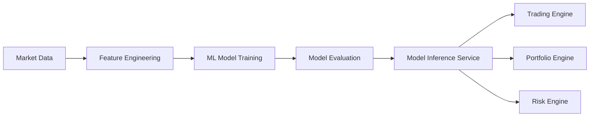

# ML Service

The **ML Service** module provides machine learning capabilities for the RustQuant platform.

It enables training, evaluation, and inference of models used for financial prediction, trading signal generation, and quantitative analytics.

The service integrates with the data pipeline and trading engines to transform financial data into actionable insights.

---

# Core Responsibilities

The ML service is responsible for:

- Training machine learning models on financial datasets
- Generating predictive signals for trading strategies
- Providing inference APIs for backend services
- Managing model lifecycle and evaluation
- Supporting feature-based quantitative analysis

---

# Machine Learning Capabilities

The ML service supports several machine learning algorithms commonly used in quantitative finance.

### Regression Models

Used for predicting continuous financial values such as asset prices or returns.

Examples:

- Linear Regression
- Statistical regression models

---

### Classification Models

Used for predicting discrete outcomes such as market direction.

Examples:

- Logistic Regression
- K-Nearest Neighbors

---

### Feature-Based Modeling

Financial models rely on engineered features derived from market data.

Examples include:

- Technical indicators
- Price momentum features
- Volatility measures
- Statistical signals

---

# ML Service Architecture

# Technology Stack

| Component | Technology |
|-----------|-----------|
| Language | Rust |
| ML Library | RustQuant ML Module |
| Linear Algebra | Nalgebra |
| Model Types | Regression / Classification |
| Architecture | Service-Based ML Pipeline |

---

# Development Status

Current ML service capabilities include:

- Linear regression models  
- Logistic regression models  
- K-nearest neighbors classification  
- Feature-based predictive modeling  

---

# Future Enhancements

Planned improvements include:

- Deep learning model integration  
- Reinforcement learning trading agents  
- AutoML-based strategy discovery  
- Online learning for real-time markets  
- Model monitoring and drift detection  
